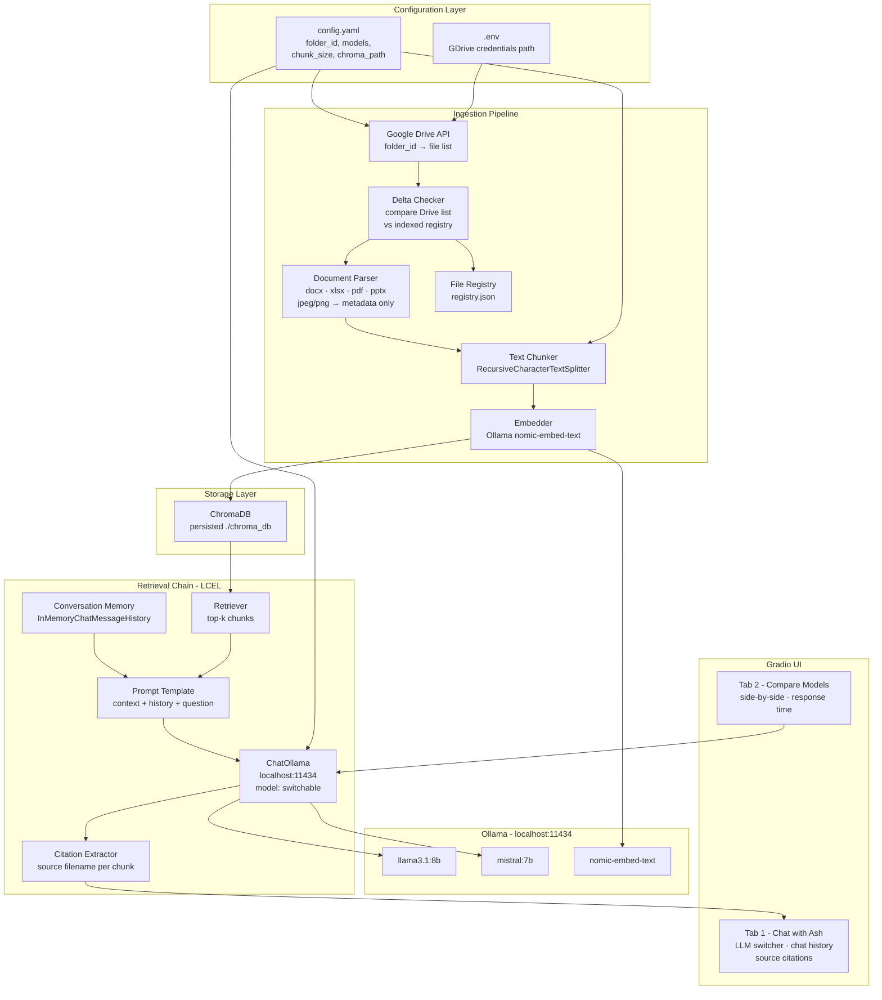

# Ask Ash 🐾
> Your local knowledge assistant

## What is this?

While studying LLMs, RAG and vector databases through IBM courses, I accumulated a large set of learning materials — labs, guides, and reference documents. At some point navigating them became a challenge in itself. So I built Ask Ash: a local Q&A assistant that lets me query my own knowledge base using natural language, compare how different LLMs respond to the same question, and apply the exact skills I was learning in the process.

## Architecture

The app follows a standard RAG (Retrieval-Augmented Generation) pattern with a delta ingestion pipeline:



- **Ingestion:** On startup, the app checks Google Drive for new or changed files (delta check), parses them (docx, xlsx, pdf, pptx), chunks the text, embeds it via Ollama, and stores vectors in ChromaDB.
- **Retrieval:** User questions are embedded and matched against stored vectors via similarity search. Top-k chunks are passed as context to the LLM.
- **Generation:** LangChain LCEL chain combines retrieved context, conversation history, and the question into a prompt. ChatOllama generates the answer with inline source citations.

## Tech Stack

| Layer | Technology |
|---|---|
| Framework | LangChain LCEL |
| LLMs | Ollama (llama3.1:8b, mistral:7b) |
| Embeddings | Ollama (nomic-embed-text) |
| Vector Store | ChromaDB (local, persisted) |
| Knowledge Base | Google Drive API |
| UI | Gradio |
| Packaging | Docker |
| Language | Python 3.11 |

## Features

- **Tab 1 — Chat with Ash:** conversational Q&A with memory, model switcher, inline source citations
- **Tab 2 — Compare Models:** side-by-side llama vs mistral responses with response time metrics
- **Delta ingestion:** only re-indexes new or changed files on startup
- **Config-driven:** swap knowledge base folder or LLMs via `config.yaml` — no code changes needed
- **Fully local:** no OpenAI API, no cloud LLMs, no data leaves your machine

## How to run

### Prerequisites
- Docker Desktop
- Ollama running locally with `llama3.1:8b`, `mistral:7b`, and `nomic-embed-text` pulled
- Google Drive API credentials (see setup below)

### Google Drive setup
1. Create a project in [Google Cloud Console](https://console.cloud.google.com)
2. Enable the Google Drive API
3. Create a Service Account and download `credentials.json`
4. Share your knowledge base folder with the service account email
5. Copy the folder ID from the Drive URL into `config.yaml`

### Run with Docker
```bash
docker-compose up
```
Open `http://localhost:7860`

### Run locally
```bash
python -m venv venv
source venv/bin/activate
pip install -r requirements.txt
python app.py
```

### Configuration
Edit `config.yaml` to change:
- `google_drive.folder_id` — point to a different knowledge base
- `ollama.available_models` — swap or add models
- `chunking.chunk_size` — adjust chunk size for different document types

## Project structure
```
local-rag-qa-assistant/
├── core/
│   ├── config_loader.py      # loads config.yaml and .env
│   ├── drive_client.py       # Google Drive API client
│   ├── file_registry.py      # delta ingestion tracking
│   ├── ingestion.py          # document parser, chunker, pipeline
│   ├── vector_store.py       # ChromaDB wrapper
│   └── rag_chain.py          # LCEL chain with memory
├── prompts/
│   ├── qa_prompt.txt         # chat prompt template
│   └── compare_prompt.txt    # comparison prompt template
├── tests/                    # unit tests
├── assets/                   # logo and static files
├── app.py                    # entry point
├── layout.py                 # Gradio UI
├── config.yaml               # configuration
└── docker-compose.yml        # Docker setup
```

## Known limitations & future improvements

- **Image content:** JPEG/PNG files are indexed by filename only — text inside diagrams is not extracted. v2 would add OCR or a vision model (LLaVA).
- **Citation consistency:** LLM citation format varies slightly between models. Prompt engineering can improve this further.
- **v2 — Ash character:** The output handler is designed to connect to Runway API to animate Ash speaking the answers. Demo recording planned.

## Part of

This project is part of a PM technical portfolio demonstrating hands-on AI engineering skills alongside product management experience.
